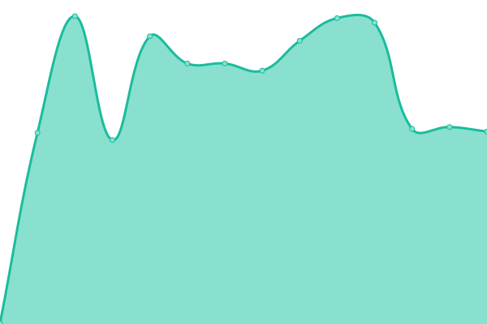
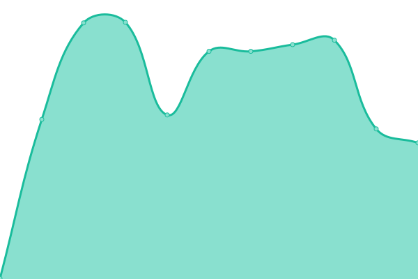

# Storyly Status

This repository powers [status.storyly.io](https://status.storyly.io) using [Upptime](https://upptime.js.org).

<!--start: status pages-->
<!-- This summary is generated by Upptime (https://github.com/upptime/upptime) -->
<!-- Do not edit this manually, your changes will be overwritten -->
<!-- prettier-ignore -->
| URL | Status | History | Response Time | Uptime |
| --- | ------ | ------- | ------------- | ------ |
|  [SDK API](https://api.storyly.io/health) | 🟥 Down | [sdk-api.yml](https://github.com/Netvent/storyly-status/commits/HEAD/history/sdk-api.yml) | 

 407ms
     
 | 

<a href="https://status.storyly.io/history/sdk-api">100.00%</a>
    

|  [SDK API (Open)](https://open.storyly.io/health) | 🟥 Down | [sdk-api-open.yml](https://github.com/Netvent/storyly-status/commits/HEAD/history/sdk-api-open.yml) | 

 355ms
     
 | 

<a href="https://status.storyly.io/history/sdk-api-open">100.00%</a>
    

|  [Event Tracking](https://trk.storyly.io/health) | 🟥 Down | [event-tracking.yml](https://github.com/Netvent/storyly-status/commits/HEAD/history/event-tracking.yml) | 

 446ms
     
 | 

<a href="https://status.storyly.io/history/event-tracking">100.00%</a>
    

|  [Dashboard](https://dashboard.storyly.io) | 🟥 Down | [dashboard.yml](https://github.com/Netvent/storyly-status/commits/HEAD/history/dashboard.yml) | 

 380ms
     
 | 

<a href="https://status.storyly.io/history/dashboard">100.00%</a>
    

|  [Core API](https://core.storyly.io/health) | 🟥 Down | [core-api.yml](https://github.com/Netvent/storyly-status/commits/HEAD/history/core-api.yml) | 

 368ms
     
 | 

<a href="https://status.storyly.io/history/core-api">100.00%</a>
    

|  [Studio](https://studio.storyly.io) | 🟥 Down | [studio.yml](https://github.com/Netvent/storyly-status/commits/HEAD/history/studio.yml) | 

 381ms
     
 | 

<a href="https://status.storyly.io/history/studio">100.00%</a>
    

<!--end: status pages-->

## Posting Incidents

1. Go to **Issues** tab
2. Create a new issue with the `incident` label
3. The incident will appear on the status page automatically
4. Close the issue when the incident is resolved

> Only netvent org members can create issues.

## Infrastructure

- **GitHub Pages**: `gh-pages` branch → `status.storyly.io`
- **DNS**: Route53 CNAME `status.storyly.io` → `netvent.github.io`
- **SSL**: Let's Encrypt via GitHub Pages (auto-renewed)
- **Secret**: `GH_PAT` — classic PAT with `repo` scope
